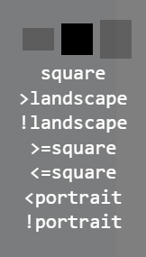

# Media Queries for modern devices!

**Sass Modern MQ** is a [Sass](http://sass-lang.com/) mixin that helps you to compose your css media queries in a simpler and accurate way

### Only 3 breakpoints

`landscape`, `square`, `portrait`

`███` → `▐█▌` → `█`

_`landscape` is the lowest breakpoint\*, and `portrait` is the highest\*\*, **keep this order in mind** to understand this library_

### Combinable with 4 operators\*

`>`, `<`, `>=`, `<=`

examples: `>landscape`, `<=square` or `!portrait`

_\*`landscape` doesn't have `<`, `<=`, & `>=` operators, and \*\*`portrait` doesn't have `>`, `>=`, & `<=` operators_

## Usage

```scss
@import "sass-modern-mq/mq.scss";

.my-class {
  @include mq("landscape") {
    // for landscape only
  }
  @include mq("<portrait") {
    // for square and landscape
  }
  @include mq(">=square") {
    // for square and portrait
  }
  @include mq("portrait", "landscape") {
    // for portrait and landscape
  }
}
```

## Debug helper!

<!--  -->

Look at the right top of the [codesandbox demo](https://codesandbox.io/s/github/maximelebreton/sass-modern-mq) and **resize the window**, the **debug helper** tells you instantly wich breakpoints are active (and that's pure HTML/CSS)!

```scss
// in your .scss file
$mq-debug: true;
```

```js
// in your .js file (it just adds dynamicly the HTML markup)
import "sass-modern-mq/debug.js";
```

## Why 'modern'?

Because with modern devices, the paradigm as changed!
The current CSS/Sass libraries base their **breakpoints on the device width**, wich is (for me) **not relevant anymore**.

If we take [Bootstrap](https://github.com/twbs/bootstrap), one of the most popular CSS library, their default breakpoints are `xs: 0`,
`sm: 576px`,
`md: 768px`,
`lg: 992px`,
`xl: 1200px`,
`xxl: 1400px`

But let's take some modern devices examples (thanks [screensiz.es](http://screensiz.es/)):

- _Apple iPhone 7 plus_ is **_1080px_** width

- _Apple Watch_ is **_324px_** width.

- _Apple iMac 27-inch_ is **_5120px_** width

How can we handle these cases with **width-based** approach, when the lowest breakpoint for _Bootstrap_ is _576px_, and the highest is _1400px_, without complexity, and with accuracy?

This where **Sass Modern MQ** takes an other approach.

## Rethinking responsive layouts?

As a senior **webdesigner and front-end developper**, and after integrating many layouts with many breakpoints, I finally came accross this conclusion:

> Every resolution cases can fit in 3 types: **Landscape**, **Square** and **Portrait**

Wich is a **ratio-based** approach.

So now I try to think my design layouts with these 3 types in mind, and I hope this will be relevant for you!

## How it works?

In CSS Media Queries spec, we have [aspect-ratio](https://developer.mozilla.org/fr/docs/Web/CSS/@media/aspect-ratio).

Instead of the classical **width-based** approach:

```css
@media (max-width: 992px) { ...
```

**Sass Modern MQ** use a **ratio-based** approach:

```css
@media (aspect-ratio: 10/8) { ...
```

## Todo list

- Write tests (any help is welcome!)
- Check browser compatibilty, but probably [98%](https://caniuse.com/#feat=css-mediaqueries)?
- Thanks
